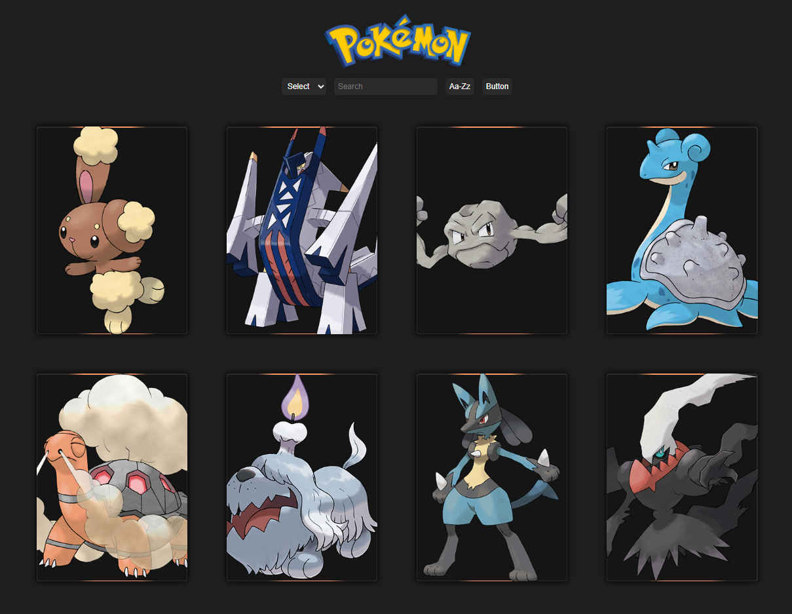

# Pokémon Cards 🃏✨



⚡ A fun little project that lets you flip through Pokémon cards — no Pokédex required!

---

## 📖 Table of Contents

* [English Version](#english-version)
* [O‘zbekcha Versiya](#o‘zbekcha-versiya)

---

## 🌍 English Version

### 📖 What is this project?

This project is a **Pokémon card gallery**.
In short: search 🔍, sort 📑, view 👀.
A modern web-app built to enjoy the world of Pokémon.

### ✨ Features

* 🔍 **Search bar** — Not a fan of Pikachu? Try typing Lucario 😉
* 📑 **Sort (A–Z / Z–A)** — Because order makes life beautiful 🌸
* 🎴 **Pokémon Card UI** — Each card shows image, weight, and other fun info
* 🌈 **From Figma to code** — All built with pure code 😂

### 🛠️ Tech Stack

* 🧩 **HTML5** — for structure
* 🎨 **CSS3** — for styling and design
* ⚡ **JavaScript (ES6)** — for interactivity and dynamic features

### 🚀 How to run?

```bash
# 1. Clone the repo
git clone https://github.com/username/pokemon-cards-app.git

# 2. Go into the folder
cd pokemon-cards-app

# 3. Open index.html in your browser
```

### 🌱 Roadmap

* ✨ Add more details to cards
* 🎞️ Flip & hover animations
* 🎮 Pokémon battle mini-game
* 📱 Full mobile optimization

### 🤝 Contributing

1. Fork the repo
2. Create a feature branch (`git checkout -b feature/awesome-feature`)
3. Commit your changes (`git commit -m 'Added awesome feature'`)
4. Push to the branch (`git push origin feature/awesome-feature`)
5. Open a Pull Request

### 📜 License

Released under the MIT License.

### 💡 Final Words

> *“Coding is like catching Pokémon: full of patience, joy, and unexpected adventures.”* 🎮

---

## 🇺🇿 O‘zbekcha Versiya

### 📖 Nima bu loyiha?

Bu loyiha — **Pokémon kartalari galereyasi**.
Oddiy qilib aytganda: qidirasan 🔍, saralaysan 📑, ko‘rasan 👀.
Pokémon olamidan zavqlanish uchun yaratilgan zamonaviy web-app.

### ✨ Xususiyatlari

* 🔍 **Search bar** — Pikachu yoqmayaptimi? Lucario yozib ko‘r 😉
* 📑 **Sort (A–Z / Z–A)** — Tartib bo‘lsa, hayot ham chiroyli 🌸
* 🎴 **Pokémon Card UI** — Har bir kartada rasmi, vazni va boshqa qiziqarli info
* 🌈 **Figma’dan kodga** — Hammasi sof kod bilan yozilgan 😂

### 🛠️ Ishlatilgan texnologiyalar

* 🧩 **HTML5** — strukturasi uchun
* 🎨 **CSS3** — dizayn va styling
* ⚡ **JavaScript (ES6)** — interaktivlik va dinamik funksiyalar

### 🚀 Qanday ishga tushirish kerak?

```bash
# 1. Clone qiling
git clone https://github.com/username/pokemon-cards-app.git

# 2. Papkaga kiring
cd pokemon-cards-app

# 3. Brauzerda index.html ni oching
```

### 🌱 Reja

* ✨ Kartalarga yanada ko‘proq ma’lumot qo‘shish
* 🎞️ Flip/hover animatsiyalar
* 🎮 Pokémon battle mini-game
* 📱 100% mobil optimizatsiya

### 🤝 Hissa qo‘shish

1. Fork qiling
2. Feature branch yarating (`git checkout -b feature/awesome-feature`)
3. O‘zgarishlarni commit qiling (`git commit -m 'Added awesome feature'`)
4. Branchni push qiling (`git push origin feature/awesome-feature`)
5. Pull Request oching

### 📜 Litsenziya

MIT License ostida tarqatiladi.

### 💡 Yakuniy gap

> *“Kod yozish — bu ham Pokémon tutish kabi: sabr, zavq va kutilmagan sarguzashtlar bilan to‘la.”* 🎮
